<figure>
    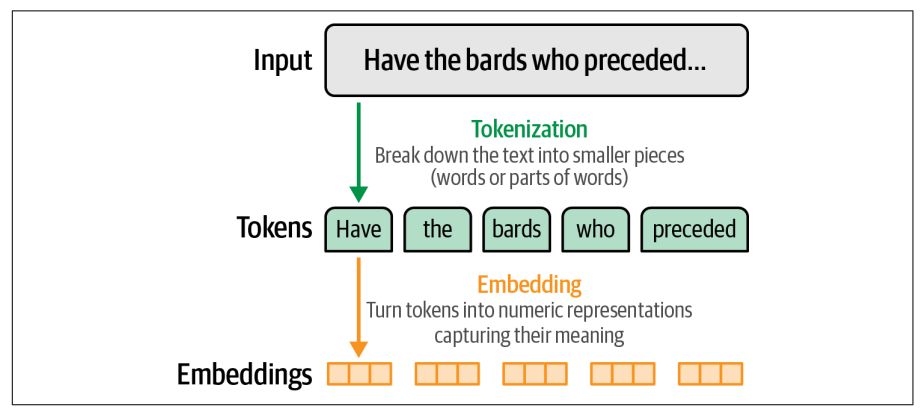
    <figcaption>Language models xử lý văn bản dưới dạng những phần nhỏ gọi là token. Để model có thể "tính toán" được ngôn ngữ, nó cần chuyển các token thành các biểu diễn số học, gọi là embedding</figcaption>
</figure>

## Tìm hiểu về LLM Tokenization
Cách mà phần lớn mọi người tương tác với language models, là thông qua một "playground" trên web, nơi cung cấp interface trò chuyện giữa user và language models.
Bạn có thể thấy model không sinh ra toàn bộ phản hồi cùng một lúc mà nó thực sự sinh ra từng token.
Token không chỉ là đầu ra của model mà chúng cũng chính là cách model "nhìn thấy" đầu vào. Một đoạn văn bản sẽ được model phân tách ra thành các token.

### How Tokenizers Prepaid the Inputs to the Language Model
Về tổng thể, generative LLMs nhận prompt đầu vào và sinh ra phản hồi.
<figure>
    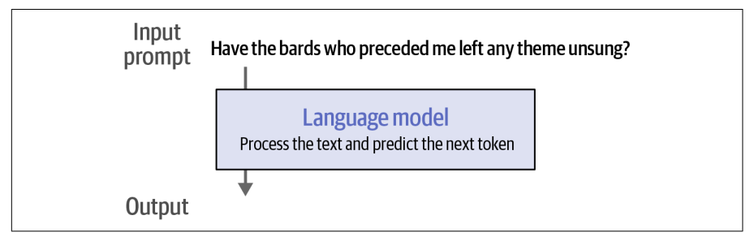
</figure>

Tuy nhiên, trước khi prompt được đưa đến model, nó phải đi qua một bộ tokenizer, thứ sẽ chia prompt thành nhiều mảnh nhỏ.
<figure>
    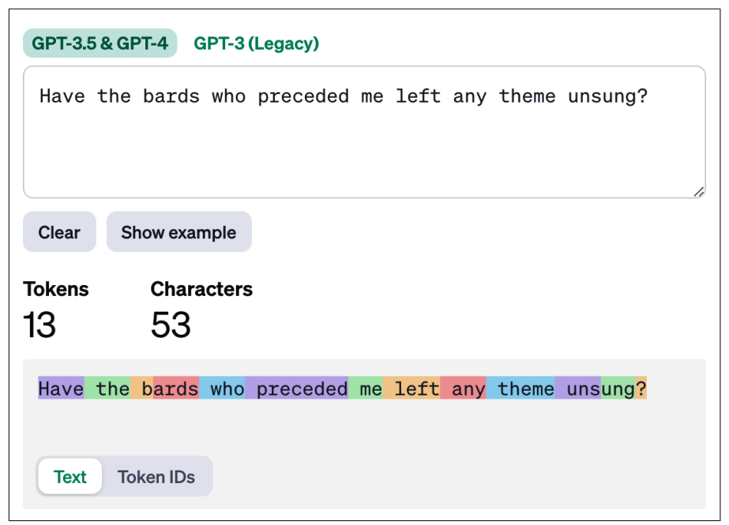
    <figcaption>Ví dụ minh họa về Tokenizer của GPT-4 trên nền tảng OpenAI</figcaption>
</figure>

### Downloading and Running an LLM

Cài đặt các thư viện cần thiết
```python
# %%capture
!pip -q install --upgrade transformers==4.41.2 sentence-transformers==3.0.1 gensim==4.3.2 scikit-learn==1.5.0 accelerate==0.31.0 peft==0.11.1 scipy==1.10.1 numpy==1.26.4
```

Tải language model và tokenizer kèm theo
```python
from transformers import AutoModelForCausalLM, AutoTokenizer

MODEL_NAME = "microsoft/Phi-3-mini-4k-instruct"

model = AutoModelForCausalLM.from_pretrained(
    MODEL_NAME,
    device_map="cuda",
    torch_dtype="auto",
    trust_remote_code=True
)

tokenizer = AutoTokenizer.from_pretrained(MODEL_NAME)
```

Ta tiến hành quá trình generation thực thụ. Đầu tiên, ta khai báo prompt, sau đó tokenizer nó, và đưa các tokens qua model.

```python
prompt = "Write an email apologizing to Sarah for the tragic gardening mishap. Explain how it happened.<|assistant|>"

# Tokenize the input prompt
input_ids = tokenizer(prompt, return_tensors="pt").input_ids.to("cuda")

# Generate the text
generation_output = model.generate(
    input_ids=input_ids,
    max_new_tokens=20
)

# Print the output
print(tokenizer.decode(generation_output[0]))
```

Output:
```tex
<s> Write an email apologizing to Sarah for the tragic gardening mishap. Explain how it happened.<|assistant|> Subject: Sincere Apologies for the Gardening Mishap
```

Ta có thể thấy model thực chất không nhận trực tiếp prompt. Thay vào đó, bộ tokenizer xử lý prompt đó và trả về thông tin mà model cần trong biến input_ids.

```python
print(input_ids)

# Output:
#     tensor([[ 1, 14350, 385, 4876, 27746, 5281, 304, 19235, 363, 278, 25305, 293,
#     16423, 292, 286, 728, 481, 29889, 12027, 7420, 920, 372, 9559, 29889, 32001]],
#     device='cuda:0')
```

Đầu vào mà các LLM phản hồi là một chuỗi số nguyên, mỗi số nguyên này là một ID duy nhất của một token cụ thể (character, word hoặc subword). Những ID này ánh xạ tới một bảng gồm các token mà tokenizer này biết.

<figure>
    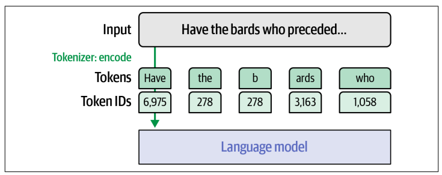
</figure>

Nếu chúng ta muốn kiểm các ID này, có thể sử dụng phương thức decode của tokenizer để có thể đổi từ ID sang text.
```python!
for id in input_ids[0]:
    print(tokenizer.decode(id), end = " / ")
```

```python!
<s> / Write / an / email / apolog / izing / to / Sarah / for / the / trag / ic / garden / ing / m / ish / ap / . / Exp / lain / how / it / happened / . / <|assistant|> /

```

Đây là cách tokenizer đã phân tách prompt input, chú ý những điểm sau:
1. First token (ID là 1), đây là một token đặc biệt dùng để chỉ điểm bắt đầu của đoạn text
2. Một vài token là một từ hoàn chỉnh. Vd: Write, an, email
3. Một vài token là một phần của từ. Vd: apolog, izing, trag, ic
4. Các ký tự dấu câu sẽ là một token riêng biệt

Chú ý rằng các kí tự space không có token riêng của nó, thay vào các parital token (giống như "izing" và "ic") có một kí tự ẩn đặc biệt ở đầu, để chỉ rằng chúng được nối liền với một token đứng trước trong văn bản. Và các token không có đặc điểm này thì được xem là một token có kí tự space đứng trước. 

Ta có thể kiểm tra các token được generate bởi model bằng cách print biến generation_output. 

```python
tensor([[ 1, 14350, 385, 4876, 27746, 5281, 304, 19235, 363, 278,
25305, 293, 16423, 292, 286, 728, 481, 29889, 12027, 7420,
920, 372, 9559, 29889, 32001, 3323, 622, 29901, 1619, 317,
3742, 406, 6225, 11763, 363, 278, 19906, 292, 341, 728,
481, 13, 13, 29928, 799]], device='cuda:0')
```

<figure>
    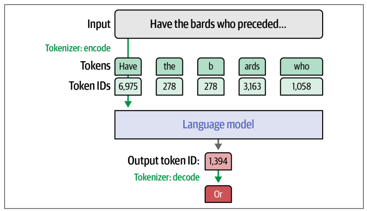
</figure>

Các token được generate ra ở phía sau token 32001 (<|assistant|>), token 3323 ("Sub") được theo sau bỏi token 622 ("ject") tạo thành từ "Subject". Giống như ở input, output được generate bởi model cũng là các ID token, ta cần sử phương thức decode của tokenizer để dịch sang văn bản thật sự.

### How Does the Tokenzier Break Down Text?

Có 3 yếu tố quyết định việc tokenizer chia các từ ra như thế nào:

- Lựa chọn phương pháp tokenization, có hai phương pháp phổ biến: Byte Pair Encoding (BPE, sử dụng bởi GPT models) và WordPiece (sử dụng bởi BERT). 
- Các tham số: vocabulary size hoặc các special token sử dụng.
- Bộ dataset được dùng để train tokenizer

### Word Versus Subword Versus Character Versus Byte Tokens
Có 4 phương pháp tokenize:

- #### Word tokens
Cách tiếp cận này phổ biến với các phương pháp cũ như word2vec, nhưng nó ngày càng ít được sử dụng trong NLP. Tuy nhiên, nó vẫn hữu ích khi được áp dụng ra ngoài lĩnh vực NLP, ví dụ như recommendation systems. 

Một nhược điểm lớn với word tokenization là tokenizer có thể không xử lý được với các từ mới xuất hiện trong dữ liệu sau khi tokenizer được train. Điều này cũng dẫn đến vocabulary chứa rất nhiều token với sự khác biệt nhỏ (apology, apologize, apologetic). 

- #### Subword tokens
Subword tokens khắc phục được nhược điểm vocabulary lớn của word tokens. Phương pháp này có một token gốc cho "apolo" và các token hậu tố như -y, -ize, -etic, vốn là các hậu tố chung cho nhiều từ khác.

Phương pháp này chứa cả các từ đầy đủ lẫn các phần của từ (full and partial words). Một ưu điểm của phương pháp này là khả năng biểu diễn các từ mới bằng cách chia từ đó thành các phần nhỏ hơn.

<figure>
    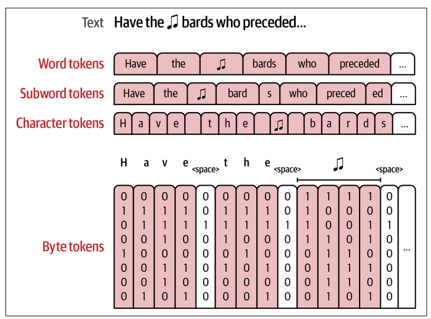
</figure>

- #### Character tokens
Một phương pháp có thể xử lý hiệu quả các từ mới vì nó có thể dựa vào chữ cái thô. Mặc dù nó giúp tokenize trở nên dễ dàng hơn nhưng việc modeling khó khăn hơn. Trong khi một model sử dụng subword tokenization chỉ tốn một token để biểu diễn từ "play", thì model sử dụng character tokenization cần phải mô hình hóa cách đánh vần "p-l-a-y" với phần còn lại của chuỗi input.

- #### Byte tokens
Một phương pháp tokenize khác là phân tách token thành các byte riêng lẻ dùng để biểu diễn ký tự Unicode. Tìm hiểu thêm: <a href="https://arxiv.org/abs/2103.06874">"CANINE: Pre-training an Efficient Tokenization-Free Encoder for Language Representation"</a>

Một điểm khác biệt đáng lưu ý: Một số subword tokenizer cũng bao gồm các byte trong vocabulary của chúng như một final building block để dự phòng cho các ký tự mà chúng không thể biểu diễn theo cách thông thường. Ví dụ như tokenizer của GPT-2 và RoBERTa hoạt động theo cách này.

### Comparing Trained LLM Tokenizers
Chúng ta sẽ so sánh các tokenizer từ cũ đến mới, xem cách chúng cái thiện performance của model. Chúng ta cũng xem các model chuyên biệt (như code generation models) cũng cần các tokenizer chuyển biệt phù hợp với chúng.

Dùng các tokenizer để encode đoạn text:
```python
text = """
English and CAPITALIZATION
🎵 鸟
show_tokens False None elif == >= else: two tabs:"    " Three tabs: "       "
12.0*50=600
"""
```

Chúng ta sẽ xem mỗi tokenizer sẽ xử lý như thế nào đối với:

- Chữ viết hoa (captialization)
- Các ngôn ngữ khác tiếng Anh
- Emojis
- Programming code với keyword và whitespaces
- Số và chữ số
- Các token đặc biệt (những token có vai trò đặt biệt trong đoạn text như token đánh dấu bắt đầu văn bản, token đánh dấu kết thúc văn bản)

```python
colors_list = [
'102;194;165', '252;141;98', '141;160;203',
'231;138;195', '166;216;84', '255;217;47'
]
def show_tokens(sentence, tokenizer_name):
    tokenizer = AutoTokenizer.from_pretrained(tokenizer_name)
    token_ids = tokenizer(sentence).input_ids
    for idx, t in enumerate(token_ids):
        print(
            f'\x1b[0;30;48;2;{colors_list[idx % len(colors_list)]}m' +
            tokenizer.decode(t) +
            '\x1b[0m',
            end=' '
        )
```

#### [BERT base model (uncased) (2018)](https://huggingface.co/google-bert/bert-base-uncased)

- Tokenization: WordPiece
- Vocabulary size: 30522
- Special token: [UNK], [SEP], [PAD], [CLS], [MASK]

Tokenized text:
<figure>
    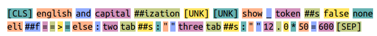
</figure>

BERT được phát hành với hai phiên bản chính:

- Cased (giữ nguyên chữ viết hoa)
- Uncased (chuyển tất cả các chữ in hoa thành chữ thường trước khi xử lý)

Với phiên bản uncased phổ biến hơn, ta thấy những đặc điểm sau:

- Dấu xuống dòng đã bị loại bỏ, model không thể thấy được thông tin encode qua các dòng mới
- Tất cả các chữ là viết thường.
- Ví dụ từ "capitalization" được encode thành các subtoken: "capital" và "##ization". Kí tự "##" được sử dụng để chỉ ra token này là partial token và được nối với một token ở trước nó. Nó cũng là phương pháp để chỉ ra kí tự space, nếu như một token không có ký tự "##" ở trước thì có kí tự space trước nó.
- Kí tự emoji và Chinese được loại bỏ và thay thế bằng token [UNK]. 

#### [BERT base model (cased) (2018)](https://huggingface.co/google-bert/bert-base-cased)

- Tokenization: WordPiece
- Vocabulary size: 28996
- Special token: Giống với phiên bản uncased

Tokenized text:
<figure>
    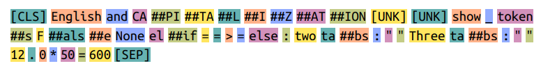
</figure>

Phiên bản cased của BERT khác biệt chủ yếu ở chỗ nó bao gồm cả các token có chữ viết hoa.

- Từ "CAPITALIZATION" được encode thành 8 token: "CA", "##PI", "##TA", "##L", "##I", "##Z", "##AT", "##ION"
- Cả hai phiên bản uncased và cased đều bao bọc bằng một token [CLS] ở đầu và token [SEP] ở cuối.
    <ul>
        <li>[CLS] là viết tắt của classification, là token thường được dùng trong tác vụ <b>phân loại câu</b></li>
        <li>[SEP] là viết tắt của seperator, là token được dùng để <b>ngăn cách các câu</b> trong một số ứng dụng cần truyền hai câu vào model.</li>
    </ul>
    
#### [GPT-2 (2019)](https://huggingface.co/openai-community/gpt2)

- Tokenization: Byte Pair Encoding (BPE)
- Vocabulary size: 50257
- Special tokens: <|endoftext|>

Tokenized text:
<figure>
    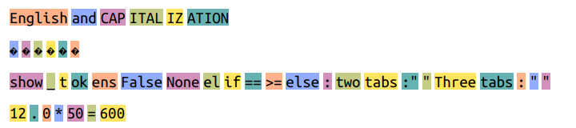
</figure>

- Ký tự xuống dòng được biểu trong tokenizer
- Chữ viết hoa được giữ nguyên, từ "CAPITALIZATION" được tác ra thành 4 token.
- Mỗi kí tự "🎵鸟" được biểu diễn bằng nhiều tokens. Mặc dù trên màn hình ta thấy các token được in ra là kí tự � nhưng thật ra chúng đại diện cho các token khác nhau trong hệ thống. Ví dụ emoji 🎵 được phân tách ra thành các token với ID lần lượt là 8582, 236, 113. Chúng ta sử dụng lệnh print(tokenizer.decode([8582, 236, 113])), nó sẽ print ra kí tự 🎵.

#### [Flan-T5 (2022)](https://huggingface.co/google/flan-t5-xxl)

- Tokenization: SentencePiece
- Vocabulary size: 32100
- Special token:
    <ul>
        <li>unk_token <unk></li>
        <li>pad_token <pad></li>
    </ul>

Tokenized text
<figure>
    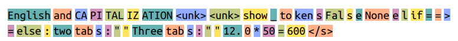
</figure>

Các model Flan-T5 sử dụng phương pháp SentencesPiece

- Ký tự xuống hàng và space đều đợc loại bỏ, tạo ra một thách thức cho model làm việc với mã code.
- Ký tự emoji và chinese được thay thế bằng \<unk>.
    
#### [GPT-4 (2023)](https://huggingface.co/google/flan-t5-xxl)
    
- Tokenization: BPE
- Vocabulary size: Hơn 100000
- Special token:
    <ul>
        <li><|endoftext|></li>
        <li>Fill in the middle tokens. Tìm hiểu thêm <a href="https://arxiv.org/abs/2207.14255">Efficient Training of Language Models to Fill in the Middle</a></li>
    </ul>
    
Tokenized text:

<figure>
    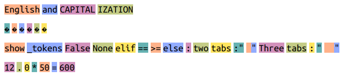
</figure>

Tokenizer GPT-4 hoạt động tương tự như tổ tiên của chúng. Một số điểm khác:

- GPT-4 encode 4 kí tự space trong 1 token duy nhất. Thực tế, nó có các token riêng biệt cho mọi chuỗi ký tự trắng (whitespace) với độ dài lên đến 83 ký tự trắng khác nhau.
- Keyword "elif" trong Python có 1 token riêng biệt trong GPT-4. Model GPT-4 có sự tập trung vào mã nguồn (code) bên cạnh ngôn ngữ tự nhiên.
- GPT-4 sử dụng ít token hơn để biểu diễn hầu hết các từ.

### Conclusion: Tokenization Is Just the Beginning

Tokenization là bước đầu tiên và cũng là nền móng để mô hình ngôn ngữ hiểu văn bản. Từ cách tách chữ cái, từ, subword cho đến những token đặc biệt, mỗi chiến lược token hóa đều ảnh hưởng trực tiếp đến khả năng hiểu và sinh ngôn ngữ của mô hình. Trong phần tiếp theo, chúng ta sẽ khám phá cách các token này được biến thành embedding vectors – hình thức mà mô hình thật sự "hiểu" ngôn ngữ.

Bonus, nếu bạn muốn bản pdf sách Hands-on Large Language Models có thể liên hệ tôi qua email <3