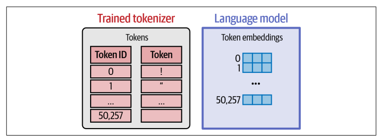
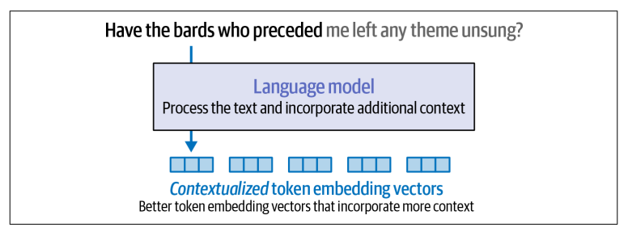
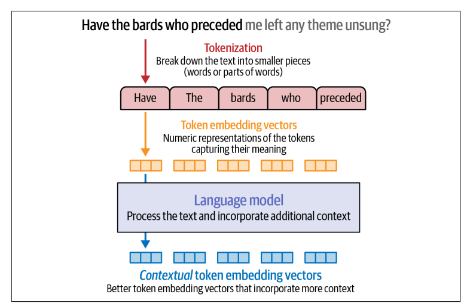
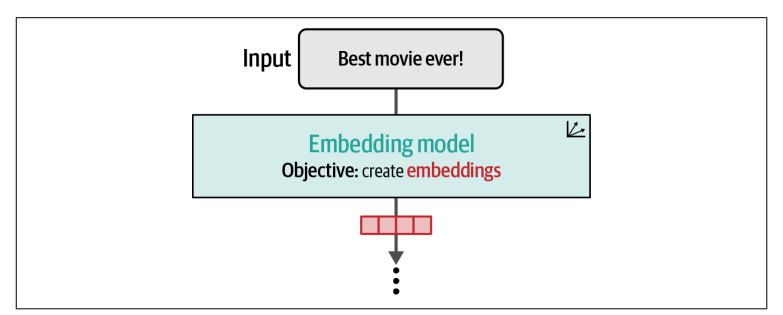
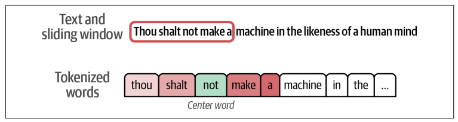
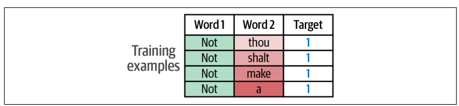
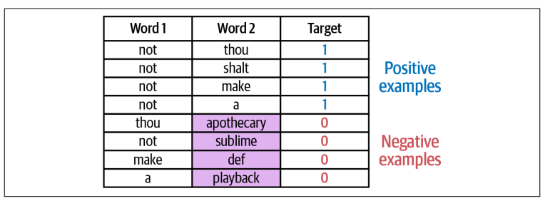
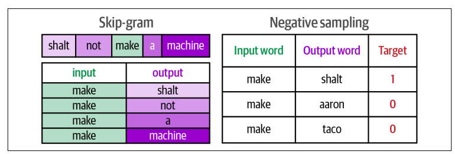
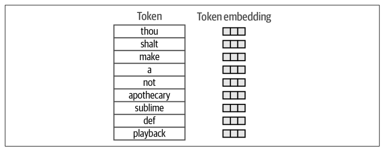
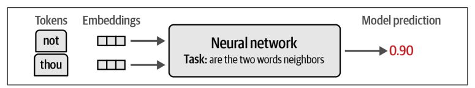

# Tokens and Embedding Part 2

## Token Embeddings

### A Language Model Holds Embedding for the Vocabulary of Its Tokenizer

Sau khi tokenizer được thiết lập và training, nó được sử dụng trong quá trình training language model đi kèm. Đó là lý do tại sao language models không thể sử dụng một tokenizer khác mà không training.

<figure>
    
</figure>

Language model giữ embedding vector cho mỗi token trong token vocabulary. Khi chúng ta tải một pretrained model về, một phần của model là embedding matrix, lưu trữ toàn bộ các embedding vector.

Trước khi training model, weight của embedding vector được khởi tạo ngẫu nhiên tương tự như weight của model.

### Creating Contextualized Word Embeddings with Language Models

Ta đã tìm hiểu về token embeddings – yếu tố đầu vào của một language model, tuy nhiên các language model có thể tạo ra các token embedding tốt hơn, và chúng làm điều đó như thế nào?

<figure>
    
</figure>

Thay vì biểu diễn mỗi token theo một vector tĩnh, language models tạo ra các vector biểu diễn từ theo ngữ cảnh (contextualized word embedding), tức là một token hay một từ sẽ được biểu diễn bằng các vector khác nhau tùy theo ngữ cảnh mà nó xuất hiện. Ngoài ra, chính các vector ngữ cảnh này cũng là nền tảng giúp vận hành các hệ thống tạo ảnh bằng AI như Midjourney, DALL-E, và Stable Diffusion.

Làm thế nào để generate ra các contextualized word embedding ?

```python
from transformers import AutoModel, AutoTokenizer

# Load a tokenizer
tokenizer = AutoTokenizer.from_pretrained("microsoft/deberta-base")

# Load a language model
model = AutoModel.from_pretrained("microsoft/deberta-v3-xsmall")

# Tokenize the sentence
tokens = tokenizer('Hello world', return_tensors='pt')

# Process the tokens
output = model(**tokens)[0]
```

Model mà chúng ta đang sử dụng ở đây có tên là DeBERTa v3, nó là một trong language models đạt hiệu suất tốt nhất cho việc tạo ra token embeddings.

Code này download pretrained tokenizer và model, ta sẽ sử dụng chúng để xử lý xâu "Hello world".

```python
output.shape
```

Output
```python
torch.Size([1, 4, 384])
```

Bỏ qua chiều thứ nhất, ta có thể đọc kết quả này như 4 tokens, mỗi token được biểu diễn bằng một vector có 384 giá trị. Chiều đầu tiên là chiều batch, được sử dụng trong trường hợp khi ta muốn gửi nhiều câu đầu vào cùng lúc vào mô hình (chúng được xử lý song song để tăng tốc độ).

Nhưng tại sao nó lại có 4 tokens trong khi input chỉ có 2 từ?

```python
for token in tokens['input_ids'][0]:
    print(tokenizer.decode(token))
```

Output

```python
[CLS]
Hello
world
[SEP]
```

Tokenizer và model cụ thể này hoạt động bằng cách thêm token [CLS] vào đầu và [SEP] vào cuối.

Language model đã xử lý trong text input. Kết quả:
```python
tensor([[
[-3.3060, -0.0507, -0.1098, ..., -0.1704, -0.1618, 0.6932],
[ 0.8918, 0.0740, -0.1583, ..., 0.1869, 1.4760, 0.0751],
[ 0.0871, 0.6364, -0.3050, ..., 0.4729, -0.1829, 1.0157],
[-3.1624, -0.1436, -0.0941, ..., -0.0290, -0.1265, 0.7954]
]], grad_fn=<NativeLayerNormBackward0>)
```
<p> Đây là raw output của language model. Về mặt kĩ thuật, <b> bước đầu tiên </b> trong một language model là <b> việc chuyển đổi các Token ID thành các raw embedding</b>. </p>

<figure>
    
</figure>

## Text Embeddings (for Sentences and Whole Documents)

Mặc dù token embedding là yếu tố cốt lõi trong cách các LLMs hoạt động, nhưng nhiều ứng dụng của LLM yêu cầu xử lý trên toàn bộ câu, đoạn văn hoặc thậm chí là tài liệu. Điều này dẫn đến sự ra đời của text embedding - tức là một vector duy nhất biểu diễn cho một đoạn văn bản dài hơn một token.

Ta có thể xem các text embedding models nhận một đoạn văn bản và cuối cùng sinh ra một vector duy nhất biểu diễn cho đoạn text và lưu giữ lại ý nghĩa của đoạn text.

<figure>
    
</figure>

Có nhiều cách khác nhau để tạo ra một text embedding vector, một trong những cách phổ biến nhất là tính trung bình các giá trị của toàn bộ token embedding mà model sinh ra. Tuy nhiên, để đạt high-quality, các text embedding model được train chuyên biệt cho các tác vụ text embedding.

Chúng ta có thể tạo text embedding với package **sentences-transformers**. Bonus, ở chương 4 cuốn sách, ta có thể tìm hiểu sâu hơn các chọn embedding model phù hợp từng tác vụ.

```python
from sentence_transfromers import SentenceTransformer

# Load model
model = SentenceTransformer("sentence-transformers/all-mpnet-base-v2")

text = "Best movie ever!"
# Convert text to text embeddings
vector = model.encode(text)
```

Số lượng chiều trong embedding vector phụ thuộc vào embedding model nền tảng.
```python
vector.shape
```

Output:
```plaintext
(768, )
```

Câu này đã được encode thành một vector với một chiều có 768 giá trị. 

## Word Embeddings Beyond LLMs

Embeddings hữu ích trên nhiều lĩnh vực, bao gồm recommeder engine và robotics. Trong phần này, ta sẽ tìm hiểu cách sử dụng model pretrained word2vec embeddings và đề cập đến cách mà model tạo ra word embedding.

### Using pretrained Word Embeddings

Ta sử dụng thư viện **gensim** để download pretrained word embeddings.

```python
import gensim.downloader as api

# Download embeddings (66MB, glove, trained on wikipedia, vector size: 50)
# Other options include "word2vec-google-news-300"
# More options at https://github.com/RaRe-Technologies/gensim-data
model = api.load("glove-wiki-gigaword-50")
```

Chúng ta có thể khám phá embedding space bằng cách xem các từ có nghĩa gần với từ được chỉ định

```python
model.most_similar([model['king']], topn=11)
```

Output:
```
[('king', 1.0),
 ('prince', 0.8236179351806641),
 ('queen', 0.7839043140411377),
 ('ii', 0.7746230363845825),
 ('emperor', 0.7736246585845947),
 ('son', 0.766719400882721),
 ('uncle', 0.7627150416374207),
 ('kingdom', 0.7542160749435425),
 ('throne', 0.7539914846420288),
 ('brother', 0.7492412328720093),
 ('ruler', 0.7434253692626953)]
```

### The Word2vec Algorithm and Contrastive Training

Thuật toán word2vec được trình bày trong paper [ “Efficient estimation of word repre‐sentations in vector space”](https://arxiv.org/abs/1301.3781) và chi tiết ở [The Illustrated Word2vec](https://jalammar.github.io/illustrated-word2vec/). 

Tương tự như LLMs, word2vec được train trên các ví dụ được sinh ra từ văn bản. Ví dụ, ta có một đoạn văn “Thou shalt not make a machine in the likeness of a human mind” từ tiểu thuyết Dune của Frank Herbert. Thuật toán sử dụng một cửa sổ trượt (sliding window) để tạo ra các ví dụ huấn luyện. Ví dụ, ta chọn kích thước của sliding window là 2, nghĩa là ta xét 2 từ lân cận mỗi bên của từ trung tâm. 

Embedding vector được tạo ra từ một bài toán classification. Bài toán này được dùng để huấn luyện mạng noron dự đoán liệu rằng hai từ có cùng xuất hiện chung trong cùng một ngữ cảnh hay không (ngữ cảnh ở đây có nghĩa là: trong nhiều câu thuộc trainset, hai từ đó xuất hiện gần nhau). Ta có thể hình dung rằng mạng noron trả về 1 nếu chúng có xu hướng xuất hiện trong cùng một ngữ cảnh, ngược lại là 0.

Ví dụ, với vị trí của sliding window dưới đây, ta thấy từ "not" ở trung tâm, ta có thể tạo được 4 training examples.

<figure>
    
</figure>

Với mỗi training example tạo ra, từ ở vị trí trung tâm được chọn làm input thứ nhất, và mỗi từ lân cận của nó là một đầu vào thứ hai riêng biệt trong từng training example. Ta kì vọng rằng sau khi model được train sẽ có khả năng phân loại mối quan hệ và trả về 1 nếu hai từ đầu vào thực sự là lân cận.

<figure>
    
</figure>

Tuy nhiên, nếu ta có dataset với giá trị target chỉ toàn là 1 thì model có thể "ăn gian" bằng cách trả về output là 1. Để khắc phục điều này, ta cần phải làm giàu dataset bằng cách thêm các **negative examples** (những example có hai từ không là lân cận của nhau).

<figure>
    
</figure>

Thực tế là ta không cần quá phức tạp khi tạo các negative examaples. Rất nhiều model hiệu quả chỉ dựa vào khả năng detect các positive examples từ các examples được tạo ngẫu nhiên (ý tưởng này gọi là [Noise-Contrastive Estimation](https://proceedings.mlr.press/v9/gutmann10a/gutmann10a.pdf)). Ta chỉ cần lấy các từ một cách ngẫu nhiên, thêm nó vào dataset và đánh target là 0.

Ta đã làm quen được hai concept chính của word2vec:

- Skip-gram: một phương pháp chọn các từ lân cận
- Negative sampling: thêm các negative examples bằng cách chọn ngẫu nhiên từ tập dữ liệu.

<figure>
    
</figure>

Trước khi thực hiện train mạng noron trên tập dataset này, ta cần phải đưa ra một vài quyết định cho tokenizaton, ví dụ như các xử lý với chữ viết hoa, dấu câu và bao nhiêu token trong vocabulary.

Mỗi token có một embedding vector được khởi tạo ngẫu nhiên (giống như cách khởi tạo weight cho mạng noron). 

<figure>
    
</figure>

Model được train dựa vào mỗi example, nhận hai embedding vector và dự đoán rằng nó có liên quan với nhau hay không.

<figure>
    
</figure>

Dựa vào kết quả dự đoán của model đúng hay sai, ta sẽ update embedding vector sao cho lần tới nếu model gặp lại example này, nó sẽ có cơ hội đoán đúng nhiều hơn. Và khi kết thúc quá trình traning, ta có các embedding vector tốt hơn cho tất cả các token trong vocabulary.