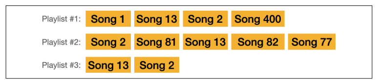
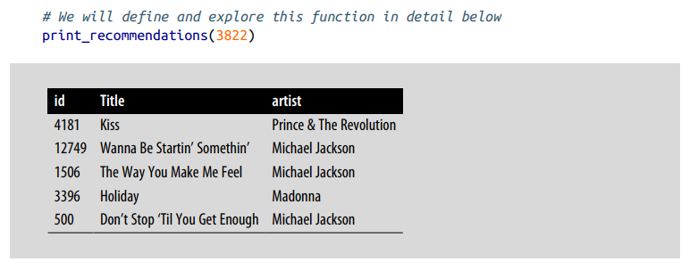
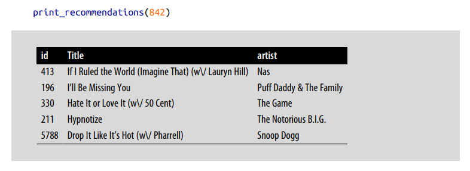

# Embeddings for Recommendation Systems

Như đã đề cập ở trong blog trước, khái niệm về embeddings rất hữu ích cho nhiều lĩnh vực khác nhau. Trong thực tế, embeddings được sử dụng rộng rãi trong các hệ thống gợi ý (recommendation systems).

## Recommending Songs by Embeddings

Trong phần này, ta sẽ sử dụng thuật toán word2vec để tạo embedding cho các bài hát, dựa trên danh sách phát (playlist) do con người tạo ra. Ta có thể tưởng tượng rằng mỗi bài hát như một từ (word hay token), và xem mỗi playlist như một câu. Và những embedding này được sử dụng để gợi ý các bài hát tương tự - tức là những bài hát thường xuất hiện cùng nhau trong một playlist.

<figure>
    
</figure>

Bộ [dataset](https://www.cs.cornell.edu/~shuochen/lme/data_page.html) mà ta sẽ sử dụng được collect bởi Shuo Chen từ Cornell University. Nó bao gồm các playlist từ hàng trăm radio station trên khắp nước Mỹ.

Ta cùng xem kết quả của end-product mà ta sẽ build. Input là ID của một bài hát và output là các bài hát được gợi ý.

Ví dụ với bài hát có tên "Billie Jean" của Micheal Jackson, với ID là 3822:

<figure>
    
</figure>

Nhìn có vẻ hợp lí, nhạc của Madonna, Prince và một vài bài khác của Micheal Jackson được gợi ý.

Một ví dụ khác sang thể loại rap, ta cùng xem các bài tương tự với "California Love" của 2Pac.

<figure>
    
</figure>

## Training a Song Embedding Model

Ta load dataset chứa playlists các bài hát và metadata như tên bài hát và tên tác giả.

```python
import pandas as pd
from urllib import request

# Get the playlist dataset file
data = request.urlopen('https://storage.googleapis.com/maps-premium/dataset/yes_complete/train.txt')

# Parse the playlist dataset file. Skip the first two lines as they only contain metadata
lines = data.read().decode("utf-8").split('\n')[2:]

# Remove playlists with only one song
playlists = [line.rstrip().split() for line in lines if len(line.split()) > 1]

# Load song metadata
songs_file = request.urlopen('https://storage.googleapis.com/maps-premium/dataset/yes_complete/song_hash.txt')
songs_file = songs_file.read().decode("utf-8").split('\n')
songs = [song.rstrip().split('\t') for song in songs_file]
songs_df = pd.DataFrame(data = songs,
                        columns = ['id', 'title', 'artist'])
songs_df = songs_df.set_index('id')
```

Ta thử kiểm tra danh sách `playlists`. Mỗi phần từ bên trong nó là một playlist chứa ID các bài hát.

```python
print('Playlist #1:\n ', playlists[0], '\n')
print('Playlist #2:\n ', playlists[1])
```

Output:
```python
Playlist #1:
  ['0', '1', '2', '3', '4', '5', '6', ..., '76', '77', '59', '20', '43'] 

Playlist #2:
  ['78', '79', '80', '3', '62', ..., '49', '201', '100', '209', '210']
```

Train model:

```python
from gensim.models import Word2Vec

# Train our Word2vec model
model = Word2Vec(
    sentences = playlists,
    vector_size = 32,
    window = 20,
    negative = 50,
    min_count = 1,
    workers = 4
)
```

Sau khi train model xong, ta có thể dùng các embeddings đó để tìm bài hát tương tự giống như ta làm với word:

```python
song_id = 2172

# Ask the model for songs similar to song #2172
model.wv.most_similar(positive=str(song_id))
```

Output:

```python
[('3167', 0.9979482293128967),
 ('2976', 0.9973394870758057),
 ('6624', 0.9972985982894897),
 ('2849', 0.996096670627594),
 ('3117', 0.9960906505584717),
 ('10084', 0.9959871172904968),
 ('3094', 0.9959680438041687),
 ('3126', 0.9956657290458679),
 ('5634', 0.995656430721283),
 ('6658', 0.9951207637786865)]
```

Danh sách những bài hát tương tự với bài hát ID số 2172. Thông tin metadata về bài hát ID 2172:

```python
print(songs_df.iloc[2172])
```

Output:
```python
title     Fade To Black
artist        Metallica
Name: 2172 , dtype: object
```


Thông tin metadata của các bài hát tương tự với bài hát ID 2172:

```python
import numpy as np

def print_recommendations(song_id):
    similar_songs = np.array(
        model.wv.most_similar(positive=str(song_id), topn=5)
    )[:, 0]
    return songs_df.iloc[similar_songs]

print_recommendations(2172)
```

Output:

|ID|Title|Artist|
|--|-----|------|
|3167|Unchained|Van Halen|
|2976|I Don't Know|Ozzy Osbourne|
|6624|Everybody Wants Some!!!|Van Halen
|2849|Run To The Hills|Iron Maiden
|3117|Still Of The Night|Whitesnake